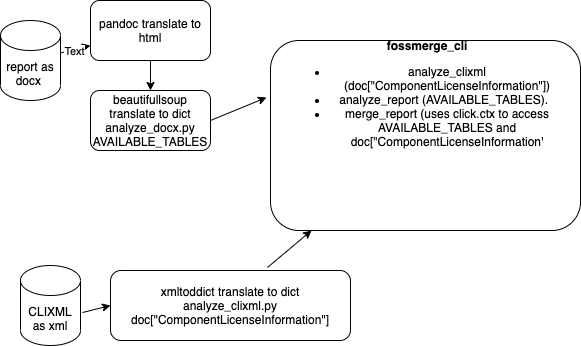

fossmerge
=========

Analyzing docx/clixml files and merging them. The Current implementation is a POC only.

The work of fossmerge is based on two documents:

-  a report (docx) file
-  a clearingstate (CLIXML) file 

The following Commands are available

   ================  ===================================  =============================================
   *analyze_clixml*  Extract data from clixml File.       poetry run fossmerge analyze_clixml
   *analyze_report*  Extract Table data from docx File.   poetry run fossmerge analyze_report
   *merge_report*    Extract data from clixml File.       poetry run fossmerge merge_report
   *Log*             Add a Log Message to the log.        poetry run fossmerge Log
   ================  ===================================  =============================================

Using the analyze_clixml command a given clixml(clearingstate)  file is analyzed. Using the  analyze_report
command a docx/report file is analyzed. Using the merge_report command the clixml's state is checked 
against the data given within a report File.

 

========================
Technical Implementation
========================

As shown in the following image:

    - *analyze_clixml* analyses  a docx file (report) and stores it's representation within a dictionary named AVAILABLE_TABLES
    - *analyze_report* analyses a clixml file and stores it's representation within a xmldict ditionary (doc[ComponentLicenseInformation]
    - based on the before defined two dictionaries a merge/analyse command *merge_report* is implemented. 

 

.. automodule:: fossmerge 
    :members:

====
Test
====

  - *make test*

======================
Generate Documentation
======================

  - *make doc*

